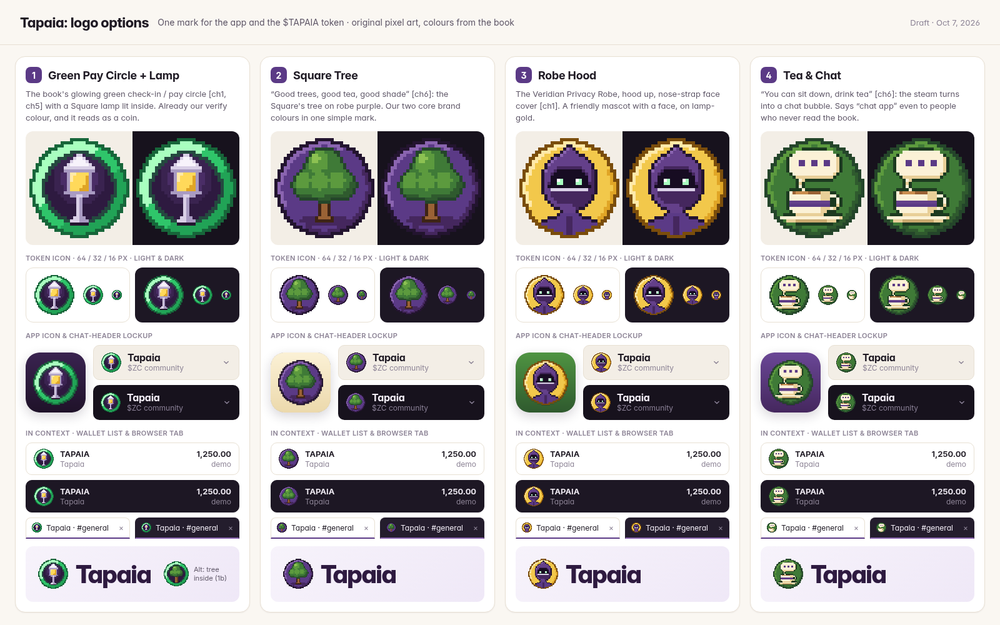

# Tapaia logo options (draft, Oct 7, 2026)

One mark for both the app and the $TAPAIA token icon. All art is original pixel art drawn by code in this folder;
colours come from `design/visual-reference.md` and `design/mockups-v2/app.css`.

| # | Option | Idea (book source) |
|---|---|---|
| 1 | `opt1-pay-circle-lamp/` | The glowing green check-in / pay circle [ch1, ch5] with a Tapaia Square lamp lit inside. |
| 1b | `opt1b-pay-circle-tree/` | Same green circle with the Square's tree inside (alt of 1). |
| 2 | `opt2-square-tree/` | "Good trees, good tea, good shade" [ch6]: the Square's tree on robe purple. |
| 3 | `opt3-robe-hood/` | Privacy-robe mascot: hood up, nose-strap face cover [ch1], on lamp gold. |
| 4 | `opt4-tea-chat/` | "You can sit down, drink tea" [ch6]: the tea's steam is a chat bubble. |

Each folder has:
- `<slug>.svg`: master mark, 32x32 pixel grid as crisp `<rect>`s (scales cleanly to any size)
- `<slug>-16.svg` / `<slug>-16.png`: hand-tuned 16x16 version for favicons and tiny token lists
- `<slug>-512.png`, `-256.png`, `-64.png`, `-32.png`: exact integer-scaled renders of the 32 grid
- `<slug>-app-icon-512.png`, `-app-icon-128.png`: rounded-square app icon

Rebuild everything with `./render.sh` (Python + Pillow, headless Chrome for the sheet).
Files: `pixel.py` (grid toolkit), `designs.py` (the art), `build_logo.py` (exports), `sheet.py` (comparison sheet).
