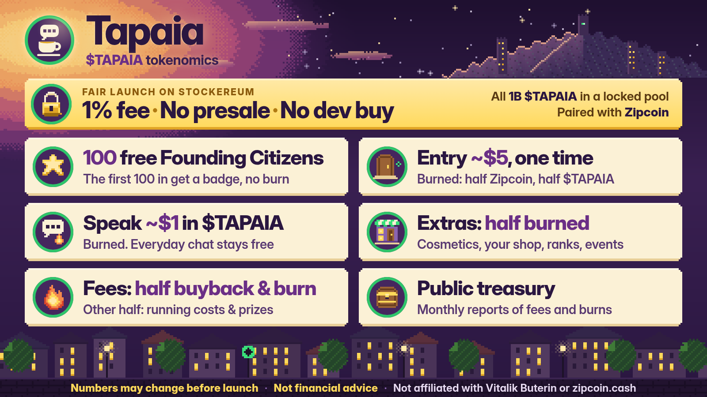

# $TAPAIA tokenomics

*Working plan, decided Oct 7, 2026. **Numbers may change before launch.***

**Not financial advice. Not affiliated with Vitalik Buterin or zipcoin.cash.**

$TAPAIA is the token for [Tapaia](../README.md), a town square in Veridia where the Zipcoin and *Snowmoon* community chats, role-plays and gathers. It launches on [Stockereum](https://stockereum.com), paired against Zipcoin (ZC), **only after the app is live**. There is no $TAPAIA contract yet, so anything calling itself $TAPAIA today is fake.

## Fair launch
- **1,000,000,000 $TAPAIA**, fixed. No minting, ever.
- The whole supply goes into Stockereum's locked Uniswap v4 pool, and the liquidity can't be pulled.
- **No presale. No team allocation. No dev buy planned.** If that ever changes, we'll say so publicly.
- **1% trading fee**, the same as Zipcoin's. Stockereum keeps 0.5% and Tapaia gets 0.5%, paid in ZC.

## Getting in
- **The first 100 citizens get in free**, with a Founding Citizen badge.
- **After that, entry is a one-time burn of about $5**, half ZC and half $TAPAIA (plus gas). It goes with your public arrival message.
- You don't need to keep holding anything afterwards. A few special rooms may ask you to hold tokens.

## Using it
- **Speak in Tapaia Square:** about $1 of $TAPAIA, burned. Everyday chat is free.
- **Extras, priced in $TAPAIA:** cosmetics (robe colors, avatar items, a tea-table spot, name colors), your own ground-floor shop on the square, Order ranks (Acolyte, Sentinel, Keeper, Herald; earned with activity, not just bought), and event tickets (tea-house nights, AMAs, Minpentai tournaments).
- **About half of every extras payment is burned.** The rest goes to the treasury.

## Where the fees go
- Of Tapaia's 0.5% share, **half buys back and burns $TAPAIA** and half pays running costs and prizes.
- **Treasury:** a dedicated wallet with a public address, held by the founder at first. Monthly public reports show the fees earned and the tokens bought back and burned. The plan is to move it to a multisig later, for example at 1,000 citizens.

## What $TAPAIA is not
- No revenue share, dividends, staking or yield. Holding $TAPAIA doesn't earn you anything.
- No price or return promises. Buyback-and-burn is a supply policy, not a price promise.
- Crypto-assets are risky. Only use what you can afford to lose, and always check the contract address against the one published in this repo.

Full details are in the [design doc](design-doc.md#7-project-token-on-stockereum-paired-against-zc) (section 7).
